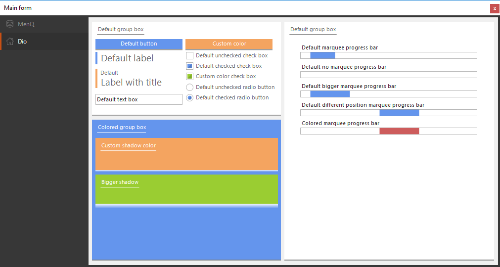

# Winform Controls
Basically some of my old winform themes/controls. Not all controls are perfectly designed nor are they bug free (although I tested them a bit and couldn't find any major issues).

I have no interest in supporting this project so do not expect any additions, although I may fix bugs if there are any (if I feel like it).

Also, sorry for the lack of comments.

If you ever use this, please leave credits!

Licensed under the Apache License 2.0.

### [Builds](builds)

# MentQ
### Preview

### Control list
* __MentQButton:__ Functions like a regular button.
* __MentQCheckbox:__ Implements only the basic functionality of a checkbox.
* __MentQEllipticalProgress:__ Elliptical progress bar, doesn't implement full progressbar functionality.
* __MentQGroupBox:__ Doesn't inherit from groupbox, rather from container control but if you don't need groupbox specific properties it shouldn't matter. You can put controls in the header and they won't dissapear when the groupbox is closed.
* __MentQInfoBox:__ Awesome control, has tons of custom properties that explain themsleves so you shouldn't be too lost. Remember to use the alpha in your colors.
* __MentQNotification:__ Literally a label in rounded box.
* __MentQNumericUpDown:__ Use the InternalNumericUpDown property to access all of the base NumericUpDown properties. This control can sometimes look buggy design time although it should return to normal in runtime.
* __MentQProgressBar:__ Regular value progressbar. Doesn't implement marquee/other modes.
* __MentQRadioButton:__ Implements only the basic functionality of a radiobox.
* __MentQTabControl:__ Vertical tabcontrol. Works with images/imagelists.

# Dio
### Preview

### Control list
* __DioButton:__ Functions like a regular button.
* __DioCheckbox:__ Implements only the basic functionality of a checkbox.
* __DioGroupBox:__ Inherits from containercontrol, can change shadow.
* __DioMarqueeProgressBar:__ Doesn't inherit from progressbar, just a start/stop marquee progress bar. Use `Start();` and `Stop();`.
* __DioRadioButton:__ Implements only the basic functionality of a radiobox.
* __DioTextBox:__ I don't recommend you use this control since it lacks the textbox functionality but looks almost similar to it. If you do use it, you can access all of the base textbox properties through the InternalTextBox property.

# How to use
__Note:__ Both of these methods work for c# and vb.net

### Cloning project (preferred way)
1. Download the controls project source for the controls you need (Dio and/or MentQ)
2. Add the project(s) to your solution.
3. On the project you want to use the controls: Add a reference to the controls project
4. The controls should now be available in your toolbox!

### Referencing a Dynamic Link Library (.dll)
1. Download the build.
2. Add it as a reference to your project.
3. In your toolbox, right click and select 'Add Tab'.
4. Once you've added the tab, right click on it and select 'Choose Items'.
5. Browse for the library.
6. Add all the controls.
7. They should now appear in your toolbox and be ready to use normally.
